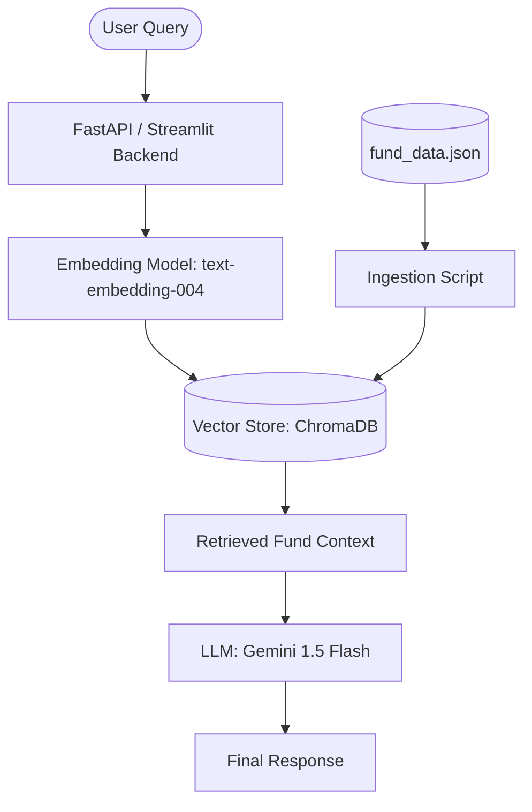

# MF Chatbot - System Architecture

This document outlines the architecture for the **Mutual Fund (MF) Chatbot**, specifically focusing on Phase 2: System Architecture. The goal is to provide a reliable, AI-powered interface for users to query mutual fund details.

## 1. High-Level System Overview

The system follows the **Retrieval-Augmented Generation (RAG)** pattern to ensure the chatbot provides accurate, data-backed responses instead of hallucinating fund details.

## 2. Core Components

### A. Data Ingestion Layer
*   **Source**: `Phase_1/fund_data.json`
*   **Process**:
    *   Load the JSON file.
    *   Convert each fund's dictionary into a natural language string (e.g., "Kotak Large Cap Fund has an NAV of ₹606.21 and an expense ratio of 0.63%...").
    *   Generate embeddings for each fund description.
    *   Store in **ChromaDB**.

### B. Retrieval Layer
*   **Search Type**: Semantic search using vector similarity.
*   **Mechanism**: When a user asks a question, the query is embedded and compared against the stored fund embeddings to find the most relevant funds.

### C. Generation Layer (The Brain)
*   **Model**: Gemini 1.5 Flash.
*   **Role**: Acts as a "Financial Expert Assistant".
*   **Input**: User query + Retrieved context from ChromaDB.
*   **Response Generation**: Generates a conversational response based *only* on the provided context to prevent hallucinations.

## 3. System Prompt Strategy

The chatbot will be guided by a strict system prompt to maintain professionalism and accuracy:
*   **Persona**: Professional Mutual Fund Advisor.
*   **Constraints**:
    *   Do not provide financial advice or buy/sell recommendations.
    *   **Out of Scope**: Do not answer questions regarding personal information (PII) or user-specific data.
    *   If information is missing from the context, explicitly state "I don't have that information."
    *   Handle "Hinglish" queries by responding in a similar tone while maintaining accuracy.

## 4. Technical Stack

| Component | Choice | Rationale |
| :--- | :--- | :--- |
| **Logic/Orchestration** | Python + LangChain | Industry standard for LLM applications. |
| **LLM** | Gemini 1.5 Flash | High performance, large context window, cost-effective. |
| **Embeddings** | Google Generative AI | Seamless integration with Gemini. |
| **Vector DB** | ChromaDB | Lightweight, open-source, and supports local persistence. |
| **Backend/UI** | Streamlit | Rapid prototyping for AI chatbots. |

## 5. Security & Privacy
*   **API Keys**: Managed via `.env` files (not committed to git).
*   **Data Privacy**: No user-identifiable information (PII) will be stored in the vector database.
